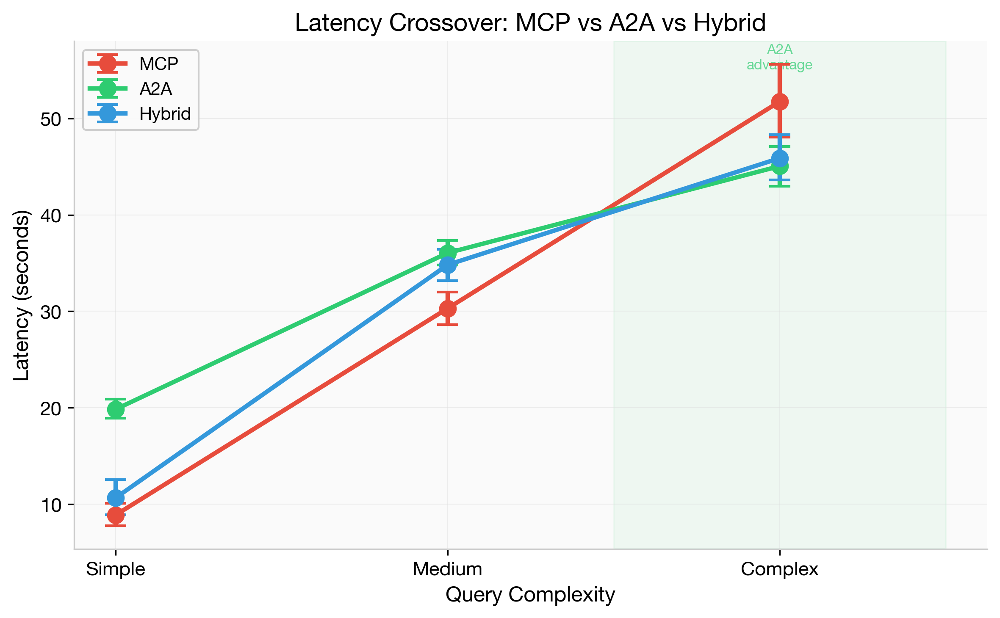
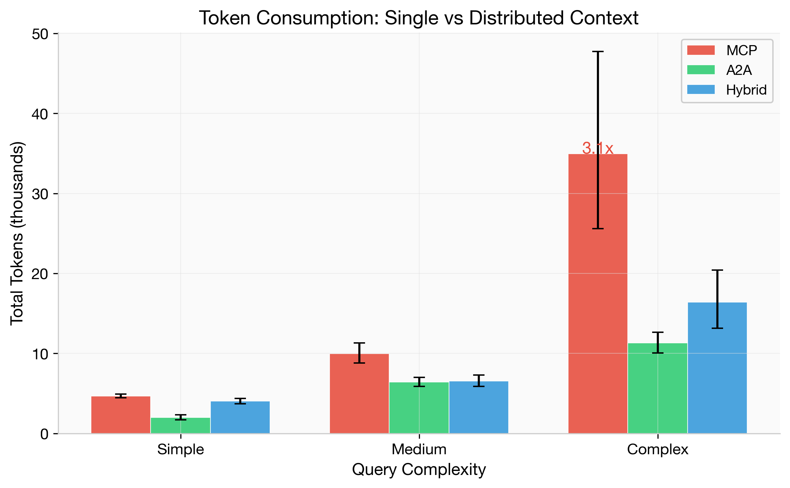
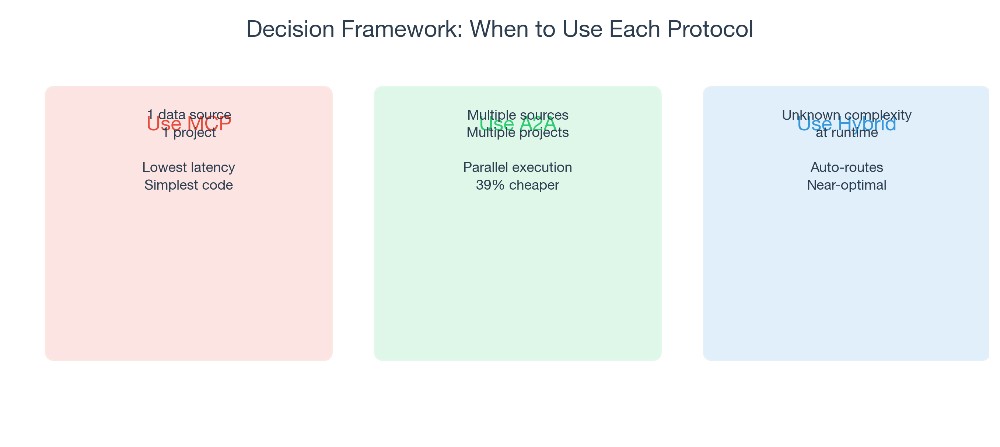

# mcp-vs-a2a-bench

### The first empirical benchmark comparing MCP and A2A agent communication protocols

<p align="center">
  
</p>

Build the **same app three ways** — MCP-only, A2A multi-agent, Hybrid — measure everything. 30 queries, 450 executions, zero failures.

---

## Results

<table>
<tr><th></th><th>Simple (n=50)</th><th>Medium (n=50)</th><th>Complex (n=50)</th></tr>
<tr><td><b>MCP</b></td><td>8.9s / $0.017</td><td>30.3s / $0.044</td><td>51.8s / $0.130</td></tr>
<tr><td><b>A2A</b></td><td>19.8s / $0.016</td><td>36.0s / $0.052</td><td><b>45.1s / $0.079</b></td></tr>
<tr><td><b>Hybrid</b></td><td>10.6s / $0.016</td><td>34.8s / $0.048</td><td>45.9s / $0.094</td></tr>
<tr><td><b>Winner</b></td><td>MCP (p&lt;0.0001)</td><td>MCP (p=0.0001)</td><td>A2A (3.1x fewer tokens, 39% cheaper)</td></tr>
</table>

<p align="center">
  
</p>

## When to use what

<p align="center">
  
</p>

## Quick Start

```bash
git clone https://github.com/IvanDobrovolsky/mcp-vs-a2a-bench.git
cd mcp-vs-a2a-bench
python3 -m venv .venv && source .venv/bin/activate
pip install -r requirements.txt

cp .env.example .env  # add your ANTHROPIC_API_KEY

# Terminal 1: start A2A agents
export $(cat .env | xargs) && python -m a2a_multi.launch

# Terminal 2: run the UI
export $(cat .env | xargs) && streamlit run app.py
```

## License

MIT
