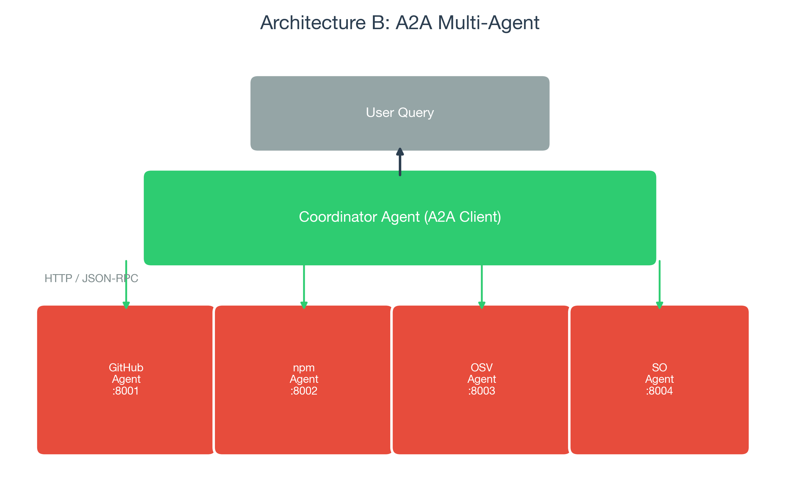

# mcp-vs-a2a-bench

### The first empirical benchmark comparing MCP and A2A agent communication protocols

<p align="center">
  
</p>

An open-source benchmark that builds the **same application three ways** — MCP-only, A2A multi-agent, and Hybrid — and measures latency, token cost, error recovery, and code complexity across **30 standardized queries** with **450 total executions**.

---

## Key Findings

<table>
<tr>
<th></th>
<th>Simple Queries</th>
<th>Medium Queries</th>
<th>Complex Queries</th>
</tr>
<tr>
<td><b>Fastest</b></td>
<td>MCP (8.9s)</td>
<td>MCP (30.3s)</td>
<td>A2A (45.1s)</td>
</tr>
<tr>
<td><b>Cheapest</b></td>
<td>All ~$0.016</td>
<td>MCP ($0.044)</td>
<td>A2A ($0.079)</td>
</tr>
<tr>
<td><b>Fewest tokens</b></td>
<td>A2A (1,988)</td>
<td>A2A (6,420)</td>
<td>A2A (11,318)</td>
</tr>
<tr>
<td><b>Significance</b></td>
<td>p < 0.0001</td>
<td>p = 0.0001</td>
<td>p = 0.12</td>
</tr>
</table>

**The crossover effect:** MCP is significantly faster for simple queries, but on complex multi-project comparisons A2A uses **3.1x fewer tokens** (distributed context) and costs **39% less**.

<p align="center">
  
</p>

## Decision Framework

<p align="center">
  
</p>

- **1 source, 1 project** &rarr; MCP (no delegation needed)
- **Multiple sources, multiple projects** &rarr; A2A (parallel + isolated context)
- **Unknown complexity at runtime** &rarr; Hybrid (auto-routes)

---

## Quick Start

```bash
# Clone and install (requires Python 3.11+)
git clone https://github.com/IvanDobrovolsky/mcp-vs-a2a-bench.git
cd mcp-vs-a2a-bench
python3 -m venv .venv
source .venv/bin/activate
pip install -r requirements.txt

# Set up environment
cp .env.example .env
# Edit .env with your ANTHROPIC_API_KEY (required) and GITHUB_TOKEN (optional)
```

### Run the Streamlit UI

```bash
# Terminal 1: Start A2A agent servers
export $(cat .env | xargs)
python -m a2a_multi.launch

# Terminal 2: Launch the UI
source .venv/bin/activate
export $(cat .env | xargs)
streamlit run app.py
# Opens at http://localhost:8501
```

The UI has a **sidebar** where you can paste your own API key — no `.env` needed.

### Run from CLI

```bash
export $(cat .env | xargs)

# Individual architectures
python -m mcp_only.agent "How many stars does React have?"
python -m a2a_multi.coordinator "Compare React vs Vue vs Svelte"
python -m hybrid.coordinator "Is Express.js still maintained?"

# Full benchmark (costs ~$25 for 5 runs)
python -m benchmark.run_benchmark --runs 5

# Analysis
python -m benchmark.analyze_results
python -m benchmark.loc_counter
```

### Docker

```bash
docker compose up                                    # Start agents + UI
docker compose --profile benchmark run benchmark     # Run full benchmark
```

---

## Three Architectures

### Architecture A: MCP-Only
```
User Query → Single Agent (one LLM) → 4 MCP Servers (stdio)
                                       ├── GitHub  ├── npm
                                       ├── OSV     └── StackOverflow
```
One agent calls tools directly. Simple, low overhead, but context window grows with every tool response. **721 LOC.**

### Architecture B: A2A Multi-Agent

<p align="center">
  
</p>

Each specialist runs as an independent HTTP server implementing the **Google A2A protocol** (Agent Cards + JSON-RPC). Coordinator discovers agents, delegates in parallel, synthesizes. **1,530 LOC.**

### Architecture C: Hybrid
Heuristic router classifies complexity (zero LLM cost). Simple → MCP. Complex → A2A. **1,914 LOC.**

---

## Data Sources

| API | Data | Auth |
|---|---|---|
| GitHub REST | Stars, forks, issues, PRs, contributors, commits | Free token (optional) |
| npm Registry | Downloads, dependencies, versions | No auth |
| OSV.dev | Known vulnerabilities by severity | No auth |
| StackOverflow | Question volume, answer rates | No auth |

## What We Measure

| Metric | Method |
|---|---|
| Latency | Wall clock (ms) |
| Token usage | Prompt + completion tokens |
| Cost | USD from Claude Sonnet pricing |
| Error recovery | Active fault injection (API errors, timeouts, agent crashes) |
| Hallucination rate | Ground-truth verification against live API data |
| Code complexity | AST-based LOC + cyclomatic complexity |

## Statistical Methods

- Bootstrap 95% CI (10,000 resamples)
- Mann-Whitney U test with Bonferroni correction
- Cliff's delta effect size

## Benchmark Suite

30 queries across 3 complexity levels, 5 runs each = **450 executions**.

| Category | Example |
|---|---|
| Simple (10) | "How many stars does React have?" |
| Medium (10) | "Give me a full health report on Express.js" |
| Complex (10) | "Compare React vs Vue vs Svelte across all health metrics" |

---

## Tests

```bash
python -m pytest tests/ -v   # 82 tests
```

## Project Structure

```
mcp-vs-a2a-bench/
├── app.py                          # Streamlit UI
├── shared/                         # API clients, models, metrics
├── mcp_only/                       # Architecture A (5 files, 721 LOC)
├── a2a_multi/                      # Architecture B (9 files, 1,530 LOC)
│   ├── a2a_server.py               # Base A2A HTTP server
│   ├── a2a_client.py               # A2A HTTP client
│   └── *_agent.py                  # Specialist agents (:8001-8004)
├── hybrid/                         # Architecture C (2 files)
├── benchmark/                      # Runner, analysis, fault injection,
│                                   # hallucination detection, LOC counter
├── paper/                          # Paper generator (gitignored)
├── tests/                          # 82 unit tests
├── Dockerfile + docker-compose.yml
└── requirements.txt
```

## Generating the Paper

```bash
pip install python-docx matplotlib kaleido
python paper/generate_paper.py
open paper/mcp_vs_a2a_paper.docx
```

Generates a full paper with 11 figures, statistical tables, and references.

---

## Tech Stack

Python 3.11+ / FastAPI / Streamlit / Plotly / MCP SDK / A2A (HTTP/JSON-RPC) / Claude Sonnet / SciPy

## License

MIT — open source, free to use, fork, and extend.
